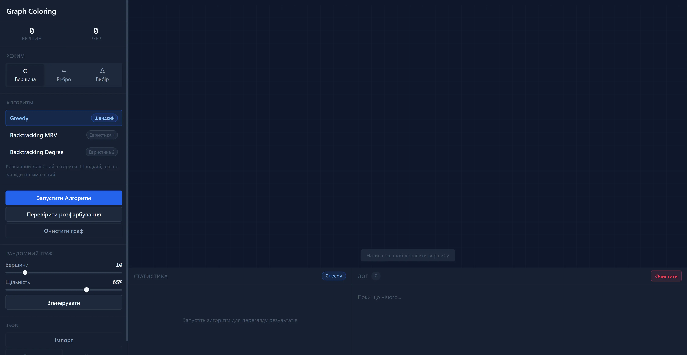
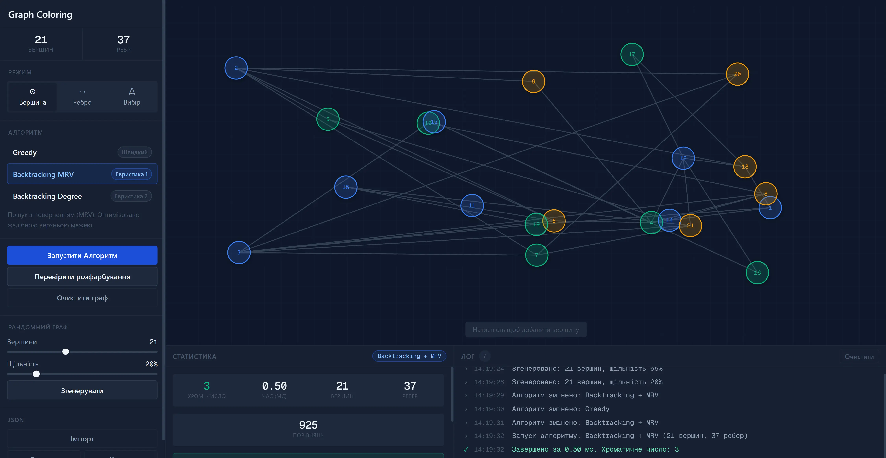
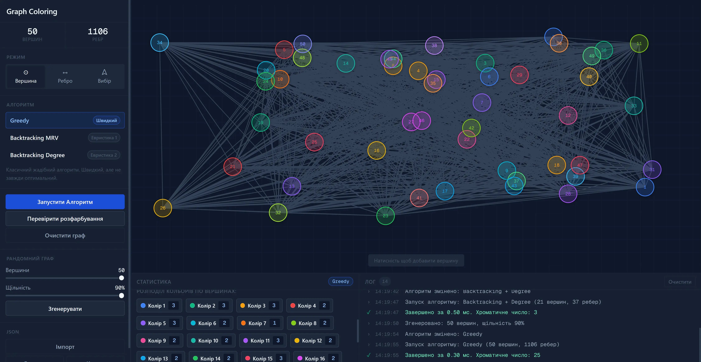

# Graph Coloring

Interactive platform for visualizing and comparing three graph coloring algorithms.

## 🚀 Demo
[Live Demo](https://graph-coloring-rouge.vercel.app/)

## 📸 Screenshots

## ✨ Features
- Interactive SVG canvas with drag-and-drop, vertex and edge creation
- Three algorithms via Strategy pattern: Greedy, Backtracking + MRV, Backtracking + Degree
- Random graph generation with configurable vertex count and edge density
- Heavy computations offloaded to Web Workers
- Detailed stats: chromatic number, execution time, comparison counter
- JSON import/export of graph structure
- Built-in conflict validation module

## ⚠️ Note
Optimized for desktop only. The canvas has a fixed size and is not responsive.

## 🛠️ Tech Stack
- React
- TypeScript
- Web Workers
- SVG
- SCSS Modules

## ⚙️ Getting Started
git clone https://github.com/Trothing/Cursova.git

cd Graph-Coloring

npm install

npm run dev
